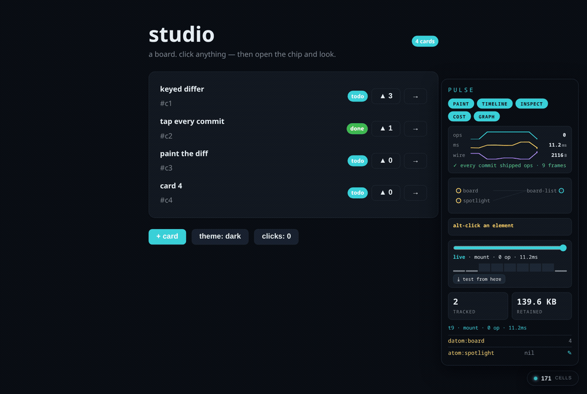

# The studio — dev tooling that is just more views of values the app already makes



Run it:

```sh
BL_SERVE=1 mix beam_lisp.run --path priv examples/data/studio.bl
# http://127.0.0.1:4088            the app, with the chip in the corner
# http://127.0.0.1:4088/__pulse/converge   two viewers side by side
```

## The idea, from zero

A beam-lisp live app produces three streams of plain data just to work:

- **where** — every patch op the differ emits carries a `path` to one exact
  element (`[:text [1 0 0 1 1 0] "▲ 4"]`);
- **when** — every commit has a basis (the datom log's clock), and the
  socket keeps the whole rendered tree as a value;
- **why** — a `pulse/traced` subtree records that it recomputed, and which
  cells it declared as deps.

Other dev tools *reconstruct* what an app did by spying on it — instrumenting
components, recording actions to replay, sampling profilers. Here the tool
does not reconstruct. It **taps** the three streams and renders them, with
the same hiccup and the same patch loop the app uses. That is the whole
design, and it is why each instrument below is small.

## The one foundation: `data.tap`

`data.tap` is a pattern (a building block), not a tool: a bounded ring of
frames stamped with a monotonic `:t`, plus a subscriber set. It knows nothing
about UI. `live.socket` publishes to it — `{kind ops tree ms basis event}`
per mount/commit — when the app is opened with `:tap`. `tooling.pulse`
subscribes. Tool uses pattern; never the reverse.

```beam-lisp
(def studio {… :tap (pulse/tap) :http (pulse/http)})   ; the whole opt-in
```

## The instruments (toggle them in the chip)

| instrument | what it does | what it reads |
|---|---|---|
| **paint** | flashes the exact elements each op touched, colour-coded by kind, tagged with frame `t` and owner (traced subtree or keyed row) | op paths + `data-tr`/`data-key` |
| **timeline** | scrub back through every frame; the past is shown in a cover over the live root, with its ops painted; release → live | the tree value retained per frame |
| **inspect** | alt-click anything: tag, attrs, its `:on-*` event terms (fire them from the chip), and every frame that touched it | the latest tree + the op ring |
| **drive** | ✎ on a tracked cell with a writer sets it from the chip | `pulse/track` writer |
| **cost** | ops · render ms · wire bytes per frame as SVG sparklines, plus "commits that shipped 0 ops" | frames |
| **graph** | cells → traced subtrees as declared; glows where the last update flowed | `pulse/traced {name ref}` deps |
| **test from here** | the frames from the scrubber to now become a `deftest` that replays the events and asserts what each changed | `{event ops}` per frame |
| **converge** | two real sockets side by side; click in either, both paint; the bar reports shared basis | `[:tap t basis]` |

## Proofs, per wave

Each wave was driven in a browser and captured; every claim below is
observed, not inferred.

- W1 paint — `w1-paint.png`: three clicks painted `text·t2·row:c1`,
  `text·t3·row:c2`, `insert·t4·row:c4`, `text·t4·screen:root`.
- W2 timeline — `w2-timeline.png`: scrubbed to t3 shows 3 cards and dark
  theme (the 4th card and light theme arrived later), with t3's two ops
  painted on the past tree.
- W3 inspect + drive — `w3-inspect.png`: inspected the vote button, pressed
  **fire** in the chip → ▲4 → ▲5 (a real committed intent); set `spotlight`
  from the chip → row lit, painted `set-attr·t4·row:c2`.
- W4 graph + cost — `w4-graph-cost.png`: `board→board-list` and
  `spotlight→board-list` drawn from one declaration; board + board-list
  glow for the vote that just landed.
- W5 click-to-test — `w5-export.png` and
  `test/bl/tooling/recorded_scenario_test.bl`, which is verbatim studio
  output and runs green.
- W6 converge — `w6-converge.png`: B advanced c2; both viewers flashed
  `text·row:c2`; bar reads `A@basis 1000004 · B@basis 1000004 — converged ✓`.

## Honest limits

- The timeline shows the **rendered tree** at t, not the world at t; for a
  datom-backed app the two coincide, but locals are only what the tree
  captured. `datom/as-of` exists to go further; not wired here.
- The tap ring is bounded (300 frames) and holds trees; pulse's own
  "retained" vital shows what that costs — it is the leak detector for the
  tool itself.
- `set!` evaluates the value as bl. The chip is a dev instrument with full
  authority (it can already fire any intent); do not serve `pulse/http` in
  production.
- Paint resolves op paths after the patch applied; a `remove` op therefore
  flashes the node now at that slot (its neighbour), not the removed one.
